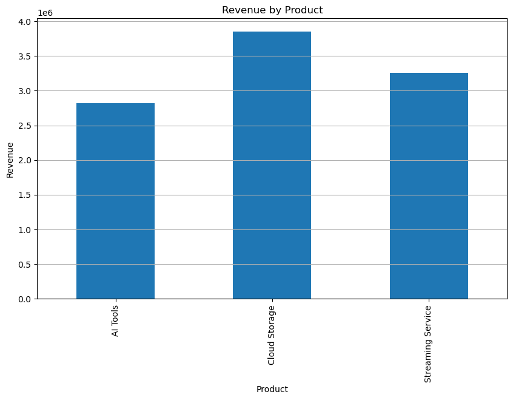

# Product Analytics SQL + Python Revenue Model

## Overview
This project analyzes product performance across a technology company using SQL and Python. The analysis focuses on revenue performance, profitability, and key unit economics.

## Visualization

## Tools Used
- Python
- Pandas
- SQLite
- Matplotlib

## Key Metrics
- Revenue by product
- Profit by product
- Customer acquisition cost (CAC)
- Average revenue per user (ARPU)

## Insights
SQL queries were used to rank product performance and identify the highest revenue and profit generating products.
